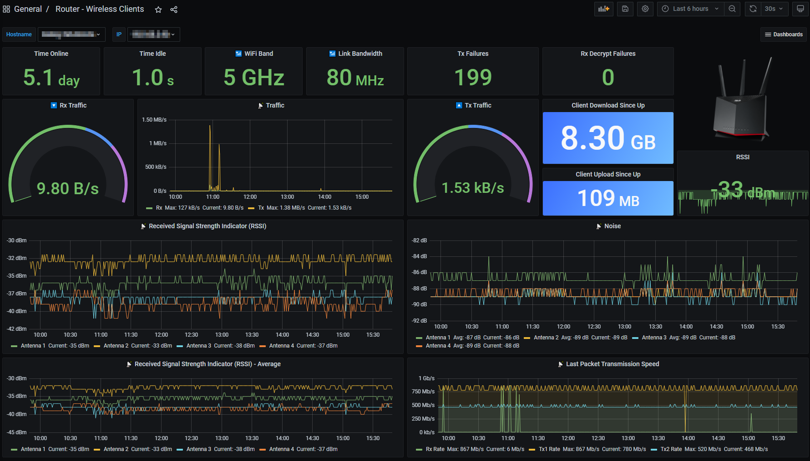

# ASUS router metrics in Grafana (via SNMP)
Config files and scripts for pulling ASUS router metrics into TIG stack via SNMP.

The implementation takes advantage of [SNMP Extend](http://net-snmp.sourceforge.net/wiki/index.php/Tut:Extending_snmpd_using_shell_scripts) to pull additional metrics (not covered by MIBs) through custom commands, as well as a shell script to pull wireless client metrics (second image) and push the data directly into InfluxDB.

Tested with ASUS RT-AX86U running Asuswrt-Merlin v386.1_2.
## Pre-requisites
1. [Asuswrt-Merlin](https://www.asuswrt-merlin.net/) firmware installed on the router.
2. SNMP enabled on router. (Menu: Administration -> SNMP)
3. JFFS custom scripts and configs enabled on router. (Menu: Administration -> System -> Persistent JFFS2 partition -> Enable JFFS custom scripts and configs)
4. Awareness of how to configure [user scripts](https://github.com/RMerl/asuswrt-merlin.ng/wiki/User-scripts) and [scheduled tasks](https://github.com/RMerl/asuswrt-merlin.ng/wiki/Scheduled-tasks-(cron-jobs)) on router.  
5. TIG stack deployed.
## Contents
1. Router [SNMP config append file](./asus-snmp_config/snmpd.conf.add) to define SNMP Extend
2. SNMP Extend [shell scripts](./asus-snmp_scripts/) for pulling the following metrics on the router:
	* Connection count
	* Active connection count
	* Admin web session - source IP of active/last session
	* Admin web session - timestamp (returns a value when someone is logged in)
	* Internet connection status
	* JFFS partition usage (%)
	* Number of active SSH sessions
	* Number of processes running
	* Temperature - CPU
	* Temperature - 2.4 GHz Wireless Module
	* Temperature - 5 GHz Wireless Module
	* Wireless client count - 2.4 GHz
	* Wireless client count - 5 GHz
3. [Shell script](./asus-scripts/) for pulling wireless client metrics and pushing the data directly into InfluxDB (in-memory processing on router) 
3. Grafana [dashboard config files](./grafana/) (use [Flux](https://docs.influxdata.com/influxdb/v2.0/query-data/get-started/) to query InfluxDB)
4. Telegraf [router SNMP config](./telegraf/snmp_asus.conf)
## Configuration notes
* Individual (per-metric) scripts are being used for SNMP Extend so as to avoid commands being run unnecessarily when the OIDs are being queried.
* The Telegraf config file I've based my config on is sourced from [bretmlw](https://github.com/bretmlw/rt-n66u-snmp-telegraf-grafana). I've commented out everything that didn't return results for me, as well as things that I'm not planning on using near-term. I've also added comments to a number of OIDs from their respective MIBs for (hopefully) improved clarity.
* The shell script for gathering wireless client metrics is based on [mod_wifi_clients.sh](https://github.com/corgan2222/extstats/blob/master/mod_wifi_clients.sh) from corgan2222's excellent [extstats](https://github.com/corgan2222/extstats) add-on.