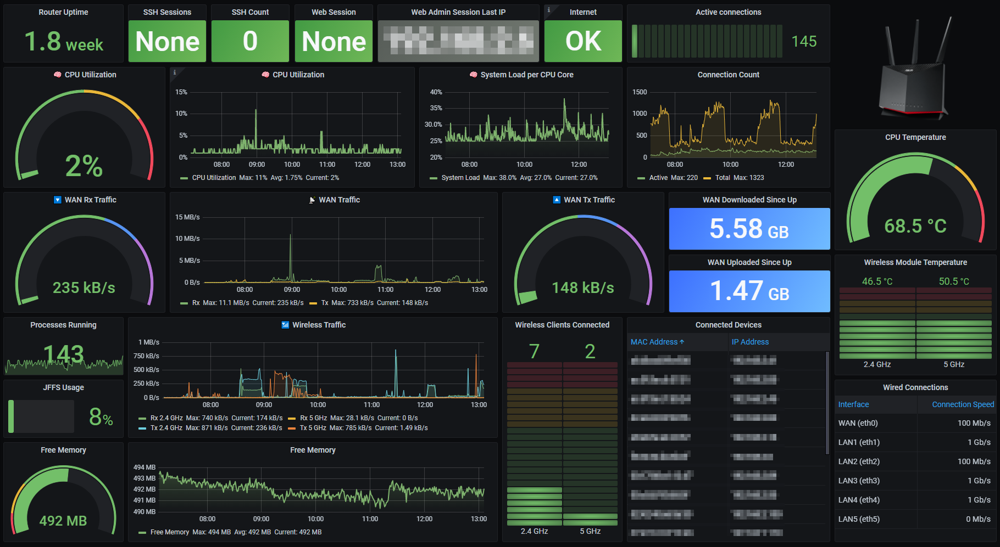

# ASUS router metrics in Grafana (via SNMP)
Config files and scripts for pulling ASUS router metrics into TIG stack via SNMP.

The implementation takes advantage of [SNMP Extend](http://net-snmp.sourceforge.net/wiki/index.php/Tut:Extending_snmpd_using_shell_scripts) to pull additional metrics (not covered by MIBs) through custom commands.

Tested with ASUS RT-AX86U running Asuswrt-Merlin v386.1_2.
## Pre-requisites
1. [Asuswrt-Merlin](https://www.asuswrt-merlin.net/) firmware installed on the router.
2. SNMP enabled on router. (Menu: Administration -> SNMP)
3. JFFS custom scripts and configs enabled on router. (Menu: Administration -> System -> Persistent JFFS2 partition -> Enable JFFS custom scripts and configs)
4. TIG stack deployed.
## Contents
1. Router [SNMP config append file](./asus-config/snmpd.conf.add) to define SNMP Extend
2. [Shell scripts](./asus-scripts/) for pulling the following metrics
* Connection count
* Active connection count
* Admin web session - source IP of active/last session
* Admin web session - timestamp (returns a value when someone is logged in)
* Number of active SSH sessions
* Temperature - CPU
* Temperature - 2.4 GHz Wireless Module
* Temperature - 5 GHz Wireless Module
3. Grafana [dashboard config file](./grafana/router-asus.json) (uses [Flux](https://docs.influxdata.com/influxdb/v2.0/query-data/get-started/) to query InfluxDB)
4. Telegraf [router SNMP config](./telegraf/snmp_asus.conf)
## Configuration notes
* Individual (per-metric) scripts are being used for SNMP Extend so as to avoid commands being run unnecessarily when the OIDs are being queried.